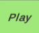
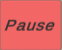
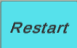
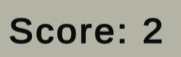
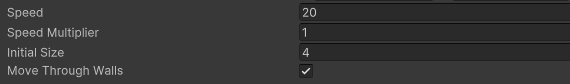

🐍 HƯỚNG DẪN LÀM GAME SNAKE (RẮN SĂN MỒI) TRONG UNITY 2D
1️⃣ Tổng quan Scene 
Trong Hierarchy đang có:
•	Main Camera
•	GridArea (khu vực chơi)
•	Snake (đầu rắn + thân)
•	Food (táo)
•	Wall (tường bao)
•	Canvas (UI: điểm số, nút)
•	GameController
•	Grid
2️⃣ Cài đặt Camera (Main Camera)
Chọn Main Camera:
•	Projection: Orthographic
•	Size: chỉnh sao cho vừa khung tường
•	Position: (0, 0, -10)
 
3️⃣ Tạo Grid (lưới di chuyển)
int x = Mathf.RoundToInt(transform.position.x) + direction.x;
int y = Mathf.RoundToInt(transform.position.y) + direction.y;
transform.position = new Vector2(x, y);
4️⃣ Tạo Snake (rắn)
📦 Cấu trúc
Snake
 ├── Head
 ├── Body_1
 ├── Body_2
Snake.cs
using System.Collections.Generic;
using TMPro;
using UnityEngine;
using UnityEngine.UI;

[RequireComponent(typeof(BoxCollider2D))]
public class Snake : MonoBehaviour
{
    public Transform segmentPrefab;
    public Vector2Int direction = Vector2Int.right;
    public float speed = 20f;
    public float speedMultiplier = 1f;
    public int initialSize = 4;
    public bool moveThroughWalls = false;

    private List<Transform> segments = new List<Transform>();
    private Vector2Int input;
    private GameController gameController;

    private int score = 0;
    private float nextUpdate;

    private void Start()
    {
        gameController = FindObjectOfType<GameController>();
        ResetState();
    }

    private void Update()
    {
        if (direction.x != 0f)
        {
            if (Input.GetKeyDown(KeyCode.W) || Input.GetKeyDown(KeyCode.UpArrow))
            {
                input = Vector2Int.up;
            }
            else if (Input.GetKeyDown(KeyCode.S) || Input.GetKeyDown(KeyCode.DownArrow))
            {
                input = Vector2Int.down;
            }
        }
        else if (direction.y != 0f)
        {
            if (Input.GetKeyDown(KeyCode.D) || Input.GetKeyDown(KeyCode.RightArrow))
            {
                input = Vector2Int.right;
            }
            else if (Input.GetKeyDown(KeyCode.A) || Input.GetKeyDown(KeyCode.LeftArrow))
            {
                input = Vector2Int.left;
            }
        }
    }

    private void FixedUpdate()
    {
        if (Time.time < nextUpdate)
        {
            return;
        }

        if (input != Vector2Int.zero)
        {
            direction = input;
        }

        for (int i = segments.Count - 1; i > 0; i--)
        {
            segments[i].position = segments[i - 1].position;
        }

        int x = Mathf.RoundToInt(transform.position.x) + direction.x;
        int y = Mathf.RoundToInt(transform.position.y) + direction.y;
        transform.position = new Vector2(x, y);

        nextUpdate = Time.time + (1f / (speed * speedMultiplier));
    }

    public void Grow()
    {
        score++;
        gameController.UpdateScoreUI(score);
        Transform segment = Instantiate(segmentPrefab);
        segment.position = segments[segments.Count - 1].position;
        segments.Add(segment);
    }

    public void ResetState()
    {
        direction = Vector2Int.right;
        transform.position = Vector3.zero;

        for (int i = 1; i < segments.Count; i++)
        {
            Destroy(segments[i].gameObject);
        }

        segments.Clear();
        segments.Add(transform);

        for (int i = 0; i < initialSize - 1; i++)
        {
            Grow();
        }
        score = 0;
        gameController.UpdateScoreUI(score);
    }

    public bool Occupies(int x, int y)
    {
        foreach (Transform segment in segments)
        {
            if (Mathf.RoundToInt(segment.position.x) == x &&
                Mathf.RoundToInt(segment.position.y) == y)
            {
                return true;
            }
        }

        return false;
    }

    private void OnTriggerEnter2D(Collider2D other)
    {
        if (other.gameObject.CompareTag("Food"))
        {
            Grow();
        }
        else if (other.gameObject.CompareTag("Obstacle"))
        {
            ResetState();
        }
        else if (other.gameObject.CompareTag("Wall"))
        {
            if (moveThroughWalls)
            {
                Traverse(other.transform);
            }
            else
            {
                ResetState();
            }
        }
    }

    private void Traverse(Transform wall)
    {
        Vector3 position = transform.position;

        if (direction.x != 0f)
        {
            position.x = Mathf.RoundToInt(-wall.position.x + direction.x);
        }
        else if (direction.y != 0f)
        {
            position.y = Mathf.RoundToInt(-wall.position.y + direction.y);
        }

        transform.position = position;
    }
}
  

5️⃣ Tạo Food (Táo)
using UnityEngine;

[RequireComponent(typeof(BoxCollider2D))]
public class Food : MonoBehaviour
{
    public Collider2D gridArea;

    private Snake snake;

    private void Awake()
    {
        snake = FindObjectOfType<Snake>();
    }

    private void Start()
    {
        RandomizePosition();
    }

    public void RandomizePosition()
    {
        Bounds bounds = gridArea.bounds;

        // Pick a random position inside the bounds
        // Round the values to ensure it aligns with the grid
        int x = Mathf.RoundToInt(Random.Range(bounds.min.x, bounds.max.x));
        int y = Mathf.RoundToInt(Random.Range(bounds.min.y, bounds.max.y));

        // Prevent the food from spawning on the snake
        while (snake.Occupies(x, y))
        {
            x++;

            if (x > bounds.max.x)
            {
                x = Mathf.RoundToInt(bounds.min.x);
                y++;

                if (y > bounds.max.y) {
                    y = Mathf.RoundToInt(bounds.min.y);
                }
            }
        }

        transform.position = new Vector2(x, y);
    }

    private void OnTriggerEnter2D(Collider2D other)
    {
        RandomizePosition();
    }
}
  
6️⃣ Wall (Dịch chuyển sang tường đối diện)
•	Tường bao quanh Grid
•	Gắn BoxCollider2D
•	Tag: Wall
else if (other.gameObject.CompareTag("Wall"))
{
    if (moveThroughWalls)
    {
        Traverse(other.transform);
    }
    else
    {
        ResetState();
    }
}
  
7️⃣ Cắn thân là thua
private void OnTriggerEnter2D(Collider2D other)
{
    if (other.gameObject.CompareTag("Food"))
    {
        Grow();
    }
    else if (other.gameObject.CompareTag("Obstacle"))
    {
        ResetState();
    }
    else if (other.gameObject.CompareTag("Wall"))
    {
        if (moveThroughWalls)
        {
            Traverse(other.transform);
        }
        else
        {
            ResetState();
        }
    }
}
8️⃣ Hoàn thiện Game
✔ Rắn di chuyển theo ô
✔ Ăn táo → dài ra
✔ Đụng tường → thua
✔ Cắn thân → thua
✔ Có UI & restart
Đây là cấu trúc Snake Game chuẩn, đúng với scene bạn đang dùng trong hình.

## Tính Năng

Điều khiển rắn bằng phím Mũi tên hoặc W, A, S, D

Rắn dài ra khi ăn thức ăn

Tùy chọn cho phép đi xuyên tường

Hiển thị điểm số theo thời gian thực

Nút Chơi, Tạm dừng, Khởi động lại (cả nút bấm và phím cách)

Có thể điều chỉnh các thông số trò chơi

## Yêu cầu

 Unity Hub
 
 Unity Editor 2022.3.23f1

## Cách Dùng

### Play, Pause và Restart

 : nút bắt đầu.
 
 : nút tạm dừng.
 
 : nút chơi lại.

### Hiển Thị Điểm

Điểm được hiển thị ở cuối trang.

## Điều khiển

 **Phím mũi tên / W, A, S, D**: điều khiển con rắn.
 
 **Phím cách**: chuyển từ đang chơi thành dừng game và ngược lại.
 
 **Chuột**: Click vào các nút Play, Pause và Restart.

## Cài dặt

 **Tốc độ**: giá trị ban đầu 20.
  
 **Hệ số nhân tốc độ**: cơ bản 1f.
 
 **Kích thước**: 4.
  
 **Di chuyển xuyên tường**: nếu rắn chạm tường thì rắn được dịch chuyển sang tường đối diện.
